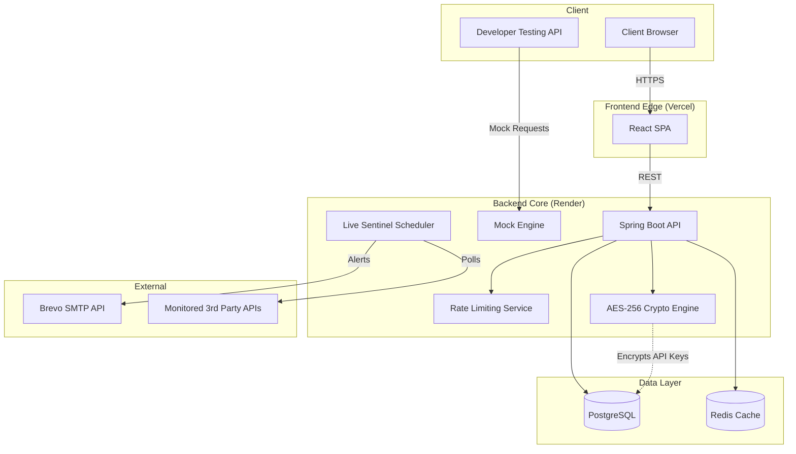

<p align="center">
  
</p>

<h1 align="center">DevForge</h1>

<p align="center">
  <strong>Ship frontend features without waiting for the backend — and know the moment your real APIs go down.</strong>
</p>

<p align="center">
  A full-stack developer platform combining an <strong>API Mock Engine</strong> (create realistic mock endpoints in seconds) with <strong>Live Sentinel</strong>, an active API monitoring and incident-alerting system — no server boilerplate for mocks, no blind spots for production APIs.
</p>

<p align="center">
  <a href="#-features">Features</a> •
  <a href="#%EF%B8%8F-tech-stack">Tech Stack</a> •
  <a href="#-architecture">Architecture</a> •
  <a href="#-getting-started">Getting Started</a> •
  <a href="#-api-reference">API Reference</a> •
  <a href="#-project-structure">Project Structure</a> •
  <a href="#-deployment">Deployment</a> •
  <a href="#%EF%B8%8F-license--intellectual-property">License & Rights</a>
</p>

---

## 🎯 What is DevForge?

DevForge solves two common pain points in modern development, both under one platform:

### 1. Frontend teams blocked by unfinished backend APIs → **Mock Engine**

Instead of hardcoding JSON files or spinning up local Express servers, DevForge lets you:

1. **Create a project** with an auto-generated API key
2. **Define mock endpoints** — method, path, status code, response body, delay
3. **Hit live URLs** from your frontend code, Postman, or curl

The mock endpoints are real HTTP routes that return your configured responses — complete with proper status codes, content types, and even simulated latency.

### 2. Real APIs failing silently in production → **Live Sentinel (Monitoring)**

Instead of finding out an API is down from a user complaint, DevForge lets you:

1. **Register any API endpoint** (yours or a third party's) with an interval and auth headers
2. **DevForge actively polls it** on a schedule, logging uptime, latency, and status
3. **Get emailed automatically** the moment consecutive failures cross a threshold — with full incident history and per-endpoint analytics available afterward

Together, the two halves cover both ends of the API lifecycle: mock what doesn't exist yet, watch what already does.

---

## ✨ Features

### Mock Engine
| Feature | Description |
|---|---|
| **Dynamic Mock Endpoints** | Create GET, POST, PUT, PATCH, DELETE endpoints with custom paths, status codes, and JSON/text responses |
| **Wildcard Path Matching** | Spring AntPathMatcher support — define patterns like `/users/{id}` or `/api/**/health` |
| **Configurable Latency** | Simulate real-world network conditions with per-endpoint delay (ms) |
| **Project Isolation** | Organize endpoints into projects, each with its own namespace and API key |
| **API Key Protection** | Optional SHA-256 hashed API key authentication per project via `X-API-Key` header |
| **Request Logging** | Every mock request is logged with method, path, status, IP, and timestamp |
| **Rate Limiting** | In-memory per-IP rate limiting (60 req/min) to prevent abuse — see [note on scaling limits](#-deployment) below |

### Live Sentinel (Monitoring)
| Feature | Description |
|---|---|
| **Active Uptime Polling** | Background scheduler pings each registered API on a user-defined interval |
| **Universal Auth Support** | Monitor APIs behind any auth scheme via customizable headers (Bearer token, API key, etc.) |
| **Incident Tracking** | Automatically logs an incident on failure/timeout and tracks it through to recovery |
| **Threshold-Based Alerting** | Emails via Brevo SMTP once consecutive failures cross a configurable threshold — no alert spam on a single blip |
| **Uptime & Latency Analytics** | Per-API uptime percentage and average latency, plus full historical ping logs |
| **Pause/Resume Control** | Toggle monitoring on a given API on or off without deleting its configuration |

### Performance & Reliability
| Feature | Description |
|---|---|
| **Redis Caching** | Cache-aside pattern with project-scoped Redis cache — zero DB hits on cache-hit |
| **Graceful Degradation** | If Redis is unavailable, the platform seamlessly falls back to PostgreSQL |
| **Non-Root Docker** | Production Docker image runs as a non-root user for security |

### Auth & Security
| Feature | Description |
|---|---|
| **Email OTP Registration** | Two-step signup: credentials → OTP verification via Brevo transactional email |
| **JWT Authentication** | Stateless auth with HMAC-SHA512 signed tokens (configurable expiry) |
| **CORS Whitelisting** | Configurable allowed origins for frontend-backend communication |
| **Spring Security** | Full Spring Security filter chain with role-based endpoint protection |
| **AES-256 Crypto** | Seamless encryption of sensitive third-party API keys stored at rest |

### Frontend & UX
| Feature | Description |
|---|---|
| **Modern React SPA** | Vite + React 19 + TailwindCSS 4 with dark/light theme persistence |
| **Interactive Dashboard** | Sidebar project navigation, endpoint table with method badges, and slide-out form drawer |
| **Live API Playground** | Homepage features an interactive mock API simulator with animated responses |
| **Contact Form** | Built-in contact form connected to the backend with email delivery via Brevo |
| **Responsive Design** | Mobile-first responsive layout with collapsible sidebar and adaptive grids |
| **Toast Notifications** | Contextual success/error toasts for all user actions |

---

## 🛠️ Tech Stack

### Backend
| Technology | Purpose |
|---|---|
| **Java 25** | Language runtime |
| **Spring Boot** | Web framework & dependency injection — *(verify exact version from `pom.xml` before publishing)* |
| **Spring Security** | Authentication & authorization |
| **Spring Data JPA** | ORM & database access |
| **PostgreSQL** | Primary relational database |
| **Redis** | Response caching layer |
| **JJWT 0.13** | JWT token generation & validation |
| **Brevo API** | Transactional OTP emails |
| **Lombok** | Boilerplate reduction |
| **Docker** | Containerized deployment (multi-stage build) |

### Frontend
| Technology | Purpose |
|---|---|
| **React 19** | UI library |
| **Vite 8** | Build tool & dev server |
| **TailwindCSS 4** | Utility-first styling |
| **React Router 7** | Client-side routing |
| **Lucide React** | Icon library |

### Infrastructure
| Service | Purpose |
|---|---|
| **Render** | Backend hosting (Docker) |
| **Vercel** | Frontend hosting (static SPA) |
| **Neon / Supabase** | Managed PostgreSQL |
| **Upstash / Redis Cloud** | Managed Redis |

---

## 🏗 Architecture



---

## 🚀 Getting Started

### Prerequisites

- **Java 25** (JDK)
- **Node.js 20+** & npm
- **PostgreSQL** (local or managed)
- **Redis** (optional — app degrades gracefully without it)

> **⚠️ SECURITY WARNING:** Never commit your actual API keys, database passwords, or JWT secrets to GitHub. Always use environment variables or a `.env` file that is listed in your `.gitignore`.

### 1. Clone the repository

```bash
git clone https://github.com/Jenish1409/DevForge.git
cd DevForge
```

### 2. Backend Setup

```bash
cd backend
```

The backend uses `application.yaml` (located at `src/main/resources/application.yaml`) which reads configuration from environment variables. Set the following environment variables before running:

| Variable | Description | Required |
|---|---|---|
| `DB_URL` | PostgreSQL JDBC URL (e.g. `jdbc:postgresql://localhost:5432/devforge`) | ✅ |
| `DB_USERNAME` | Database username | ✅ |
| `DB_PASSWORD` | Database password | ✅ |
| `JWT_SECRET` | Secret key for signing JWT tokens | ✅ |
| `BREVO_API_KEY` | Brevo transactional email API key | ✅ |
| `BREVO_SENDER_EMAIL` | Sender email for OTP emails | ✅ |
| `ADMIN_EMAIL` | Admin notification email | ✅ |
| `apisentinel.encryption.secret-key` | Minimum 16-byte key for AES-256 encryption | ✅ |
| `JPA_DDL_AUTO` | Hibernate DDL mode (default: `update`) | |
| `JPA_SHOW_SQL` | Log SQL queries (default: `false`) | |
| `SERVER_PORT` | Server port (default: `8080`) | |
| `REDIS_HOST` | Redis host (default: `localhost`) | |
| `REDIS_PORT` | Redis port (default: `6379`) | |
| `REDIS_PASSWORD` | Redis password (default: empty) | |
| `REDIS_SSL` | Enable Redis SSL (default: `false`) | |
| `ALLOWED_ORIGINS` | CORS allowed origins (default: `http://localhost:5173`) | |

You can export them in your shell or use your IDE's run configuration. (These are examples — do not use real secrets here):

```bash
export DB_URL=jdbc:postgresql://localhost:5432/devforge
export DB_USERNAME=postgres
export DB_PASSWORD=your_password
export JWT_SECRET=your-256-bit-secret-key-here
export BREVO_API_KEY=your-brevo-api-key
export BREVO_SENDER_EMAIL=noreply@yourdomain.com
export ADMIN_EMAIL=admin@yourdomain.com
export apisentinel.encryption.secret-key=super-secret-key-16bytes+
```

Run the backend:

```bash
./mvnw spring-boot:run
```

The backend starts on `http://localhost:8080`.

### 3. Frontend Setup

```bash
cd frontend
npm install
```

Create a `.env.development` file:

```env
VITE_API_URL=/api/v1
```

> In development, Vite proxies `/api` and `/mock` requests to `localhost:8080` automatically.

Run the frontend:

```bash
npm run dev
```

The frontend starts on `http://localhost:5173`.

---

## 📡 API Reference

### Authentication

| Method | Endpoint | Description | Auth |
|---|---|---|---|
| POST | `/api/v1/auth/register/init` | Start registration (sends OTP email) | No |
| POST | `/api/v1/auth/register/verify` | Verify OTP and create account | No |
| POST | `/api/v1/auth/login` | Login with credentials, returns JWT | No |

### Projects

| Method | Endpoint | Description | Auth |
|---|---|---|---|
| GET | `/api/v1/projects` | List all projects for current user | JWT |
| POST | `/api/v1/projects` | Create a new project | JWT |
| DELETE | `/api/v1/projects/{id}` | Delete a project | JWT |

### Endpoints Management

| Method | Endpoint | Description | Auth |
|---|---|---|---|
| GET | `/api/v1/projects/{projectId}/endpoints` | List endpoints for a project | JWT |
| POST | `/api/v1/projects/{projectId}/endpoints` | Create a new endpoint | JWT |
| PUT | `/api/v1/projects/{projectId}/endpoints/{endpointId}` | Update an endpoint | JWT |
| DELETE | `/api/v1/projects/{projectId}/endpoints/{endpointId}` | Delete an endpoint | JWT |

### Mock API (Dynamic)

| Method | Endpoint | Description | Auth |
|---|---|---|---|
| ANY | `/mock/{projectId}/**` | Hit a mock endpoint | Optional API Key |

**Example:**

```bash
# Create a mock endpoint for GET /users/me, then call it:
curl https://your-backend.onrender.com/mock/<project-id>/users/me \
  -H "X-API-Key: your-project-api-key"
```

### Monitoring (Live Sentinel)

| Method | Endpoint | Description | Auth |
|---|---|---|---|
| POST | `/api/v1/monitoring` | Register a new API for monitoring | JWT |
| GET | `/api/v1/monitoring` | List all monitored APIs for current user | JWT |
| GET | `/api/v1/monitoring/summary` | Get dashboard summary (counts, avg uptime) | JWT |
| GET | `/api/v1/monitoring/{id}` | Get details for a specific monitored API | JWT |
| GET | `/api/v1/monitoring/{id}/history` | Get ping history/logs for a specific API | JWT |
| GET | `/api/v1/monitoring/{id}/incidents` | Get incident history (downtime events) | JWT |
| PUT | `/api/v1/monitoring/{id}` | Update a monitored API's configuration | JWT |
| DELETE | `/api/v1/monitoring/{id}` | Delete a monitored API | JWT |
| PATCH | `/api/v1/monitoring/{id}/toggle` | Pause or resume monitoring for an API | JWT |

### Contact

| Method | Endpoint | Description | Auth |
|---|---|---|---|
| POST | `/api/v1/contact` | Submit a contact form message | No |

---

## 📁 Project Structure

```
DevForge/
├── backend/                          # Spring Boot application
│   ├── src/main/java/com/devforge/
│   │   ├── config/                   # (verify current contents — confirm which config classes actually exist)
│   │   ├── controller/               # REST controllers
│   │   │   ├── AuthController        # Registration & login
│   │   │   ├── ProjectController     # CRUD for projects
│   │   │   ├── EndpointManagement    # CRUD for mock endpoints
│   │   │   ├── DynamicMockController # Wildcard mock request handler
│   │   │   └── ContactController     # Contact form submissions
│   │   ├── dto/                      # Request/Response DTOs
│   │   ├── entity/                   # JPA entities (User, Project, MockEndpoint, MockRequestLog)
│   │   ├── exception/                # Global exception handler + custom exceptions
│   │   ├── interceptor/              # Rate limiter & request logger interceptors
│   │   ├── repository/               # Spring Data JPA repositories
│   │   ├── security/                 # JWT filter, SecurityConfig, ApplicationConfig
│   │   ├── service/                  # Business logic layer
│   │   └── util/                     # API key hashing utility
│   ├── Dockerfile                    # Multi-stage Docker build
│   └── pom.xml                       # Maven dependencies
│
├── frontend/                         # React SPA
│   ├── src/
│   │   ├── api/                      # API client (fetch wrapper with JWT)
│   │   ├── components/               # UI components
│   │   │   ├── Dashboard             # Main dashboard layout
│   │   │   ├── Sidebar               # Project navigation
│   │   │   ├── TopHeader             # Project details & API key display
│   │   │   ├── EndpointManager       # Endpoint table & actions
│   │   │   ├── EndpointFormDrawer    # Slide-out form for create/edit
│   │   │   ├── LoginView             # Login + Register + OTP flow
│   │   │   └── marketing/            # Navbar, Footer
│   │   ├── context/                  # AuthContext, ThemeContext, ToastContext
│   │   ├── layouts/                  # PublicLayout wrapper
│   │   └── pages/                    # HomePage, AboutPage, ContactPage
│   ├── vercel.json                   # SPA rewrite rules
│   └── vite.config.js                # Vite config with proxy
│
└── README.md
```

---

## 🌐 Deployment

### Backend → Render (Docker)

1. Create a new **Web Service** on [Render](https://render.com)
2. Connect your GitHub repo and set the **Root Directory** to `backend`
3. Set **Runtime** to Docker
4. Add all environment variables from the `.env` template above
5. Set `ALLOWED_ORIGINS` to your Vercel frontend URL

### Frontend → Vercel

1. Import the repo on [Vercel](https://vercel.com)
2. Set **Root Directory** to `frontend`
3. Set **Framework Preset** to Vite
4. Add environment variable:
   ```
   VITE_API_URL=https://your-backend.onrender.com/api/v1
   ```
5. Deploy — the `vercel.json` handles SPA routing rewrites automatically

### Known Limitations at Scale

- **Rate limiting is per-instance, not global.** The mock engine's rate limiter is in-memory, so if the backend is horizontally scaled to multiple instances, each instance enforces its own limit independently rather than sharing a global count. A production-scale fix would move this to a shared store (e.g. Redis-backed counters) — noted here as a known, deliberate trade-off for a single-instance deployment, not an oversight.
- **The monitoring scheduler runs as a single in-process loop.** It doesn't yet shard checks across multiple worker instances, so it doesn't horizontally scale past what one instance's scheduler thread can handle — fine for a moderate number of monitored APIs, but a real production version would move this to a distributed job queue.

---

---

## ⚠️ License & Intellectual Property

**All Rights Reserved.**

This project and its source code are the sole intellectual property of **Jenish Raichura**.

- ❌ **NO REBRANDING**: You are strictly prohibited from copying, cloning, or modifying this repository to rebrand it as your own product or service.
- ❌ **NO COMMERCIAL THEFT**: You may not sell, distribute, or host this software for commercial gain under a different name.
- ✅ **CONTRIBUTIONS ONLY**: The only permitted use of this source code is for personal learning, or for contributing back to this original repository via Pull Requests.

**Enforcement:**
Any unauthorized copying, rebranding, or theft of this source code will be actively pursued. DMCA Takedown notices will be immediately issued to hosting providers (e.g., GitHub, Vercel, Netlify, Render, AWS) to remove stolen work, and further legal action may be taken if necessary.

---

<p align="center">
  Built with ☕ and ⚡ by <a href="https://github.com/Jenish1409">Jenish Raichura</a>
</p>
